# People and Group Picker

## Summary

The *_People and Group Picker_* is a custom component developed for Power Apps Canvas apps and can be used in both Power Apps Standalone and Power Apps for Teams.
The *_People and Group Picker_* provides an intuitive and efficient way to assign tasks, manage team collaboration, and streamline project workflows within Power Apps. The Picker allows users to easily select individuals or groups, enhancing accuracy and improving the overall user experience.

The *_People and Group Picker_* leverages standard connectors Office 365 Users and Office 365 Groups, which enable the selection of users and groups without requiring additional licenses. 

The *_People and Group Picker_* offers customization options, such as color schemes, to match the app's design. Additionally, the Picker has output property where selected users and groups are storing, so this information can be used throughout the application.

## Applies to

* [Microsoft Power Apps](https://docs.microsoft.com/powerapps/)

## Compatibility

## Authors

Solution|Author(s)
--------|---------
People-and-Group-Picker | [Katerina Chernevskaya](https://github.com/Katerina-Chernevskaya) ([LinkedIn](https://www.linkedin.com/in/katerinachernevskaya/)), Awara IT Academyy

## Version history

Version|Date|Comments
-------|----|--------
1.0|May 18, 2023|Initial release

## Features

This sample illustrates the following concepts:

* Select individuals and groups from a filtered range of values
* A search field with a clean option, providing a simplified search experience
* Selected users and groups are blocked to prevent multiple selection
* The ability to remove individuals or groups from the selected list

## Prerequisites

* An environment with Dataverse
Both - Dataverse and Dataverse for Teams are suitable.

## Solution Components

The sample's solution includes just 1 component:

* People and Groups Picker - Component Library

## Minimal Path to Awesome

You can install this sample for both [Dataverse](#dtv) or [Dataverse for Teams](#dtvteams) environment. Go to the required section to get step-by-step instructions.

### [Install in Dataverse][dtv]

* Download the `.zip` from the `solution` folder
* Open `Power Apps` maker portal (https:// make.powerapps.com) and go to your dedicated environment where you would like to import the `People and Group Picker`. Go to the `Solution` tab and click `Import solution`
*_Please note, that you have to provision the Dataverse for selected environment in advance_*
* Click `Browse` and select the solution you downloaded, then click `Next`
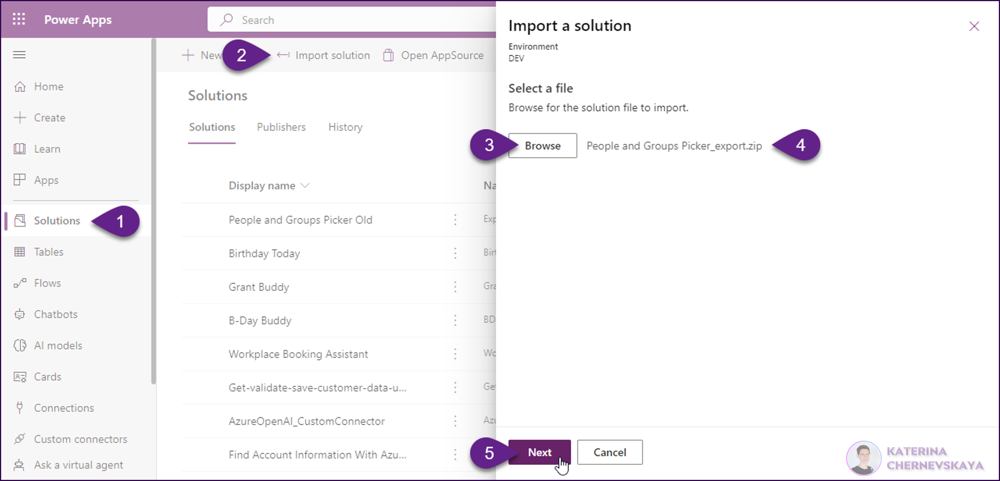
* On the next screen click `Import`
* Once the import will be completed successfully you can use the `People and Group Picker` component in your apps.

To add the `People and Group Picker` to your apps please following these steps: 
* Create a new Canvas app in this environment
* Go to `Insert` tab and click on `Get more components`. Select the `PeopleAndGroupsPicker` component and click `Import`
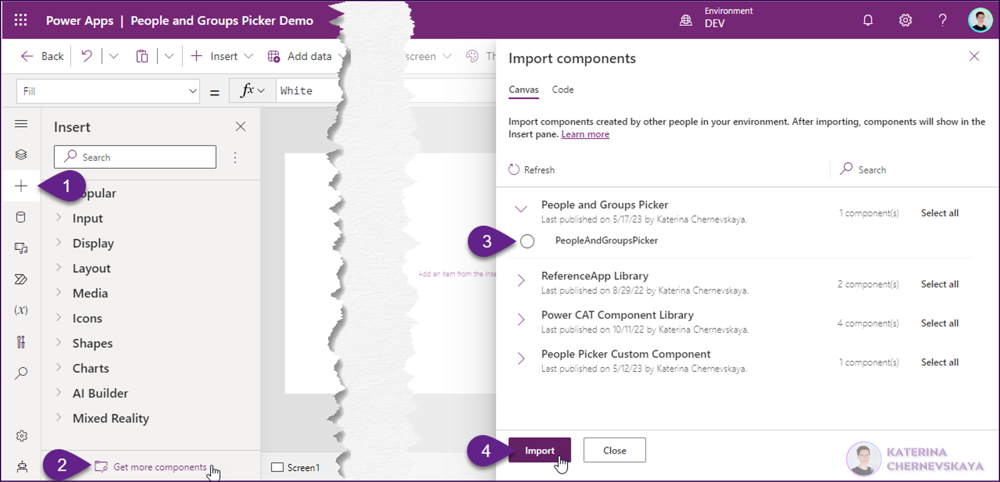
* Click `Allow` on the pop-up window to provide permissions to use Office 365 Users and Office 365 Groups connectors.
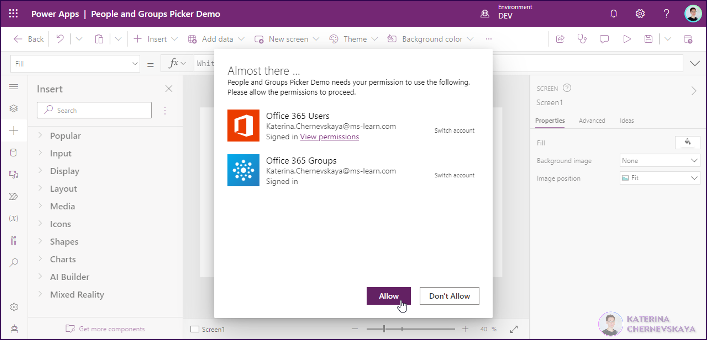
* In the `Insert` tab open the `Library components` and select the `PeopleAndGroupsPicker` component.
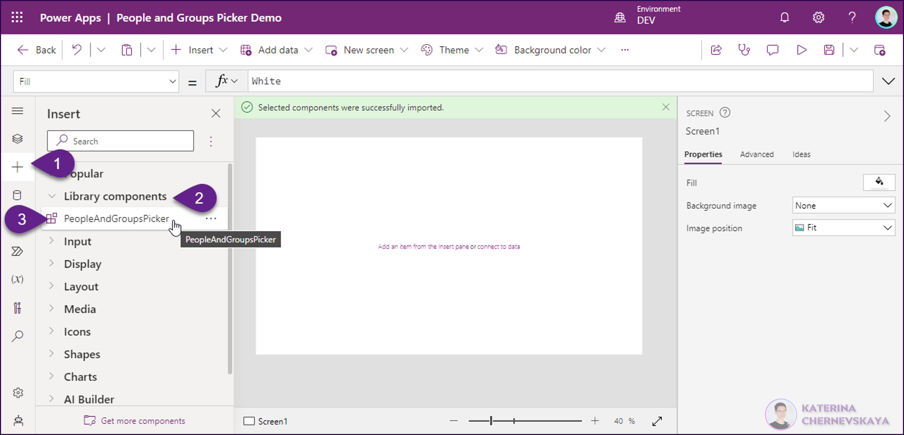

That's it. Now you can work with the `People and Groups Picker` component in your app.

To customize color schema of the component - please use its `Custom properties`:

To work with the output property you can use [COMPONENT_NAME_IN_YOUR_APP].colMembers:
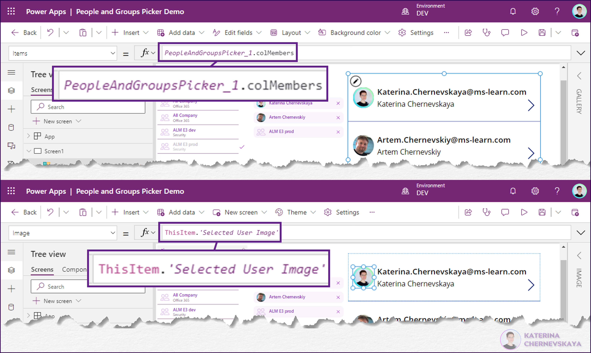

### [Install in Dataverse for Teams environment][dtvteams]

* Download the `.zip` from the `solution` folder
* Open `Power Apps for Teams` app in Microsoft Teams, go to the `Build` tab, choose the team where you would like to install the solution and click `Import your solution`
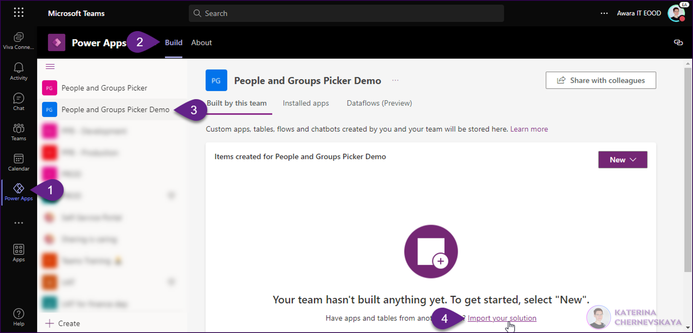
*_Please note, that you have to provision the Dataverse for Teams environment in advance for required team_*
* Click `Browse` and select the solution you downloaded, then click `Next`
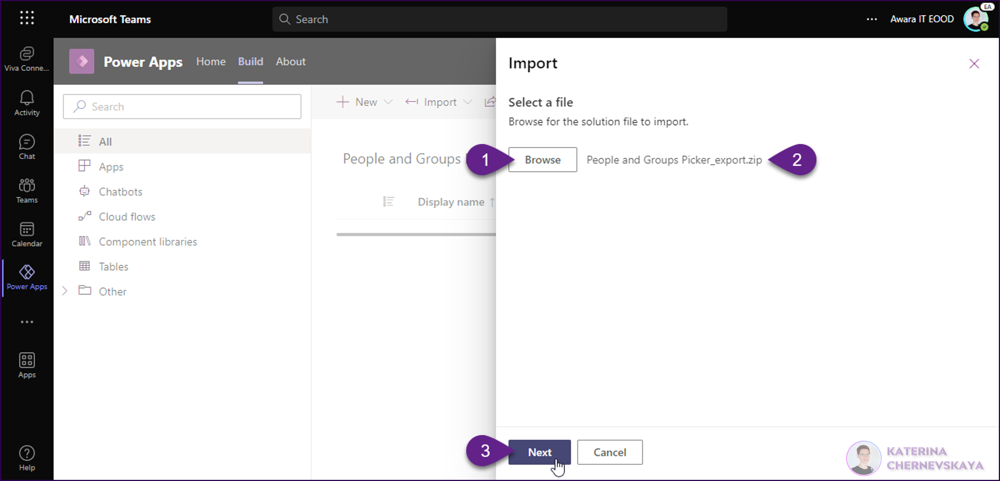
* On the next screen click `Import`
* Once the import will be completed successfully go to `Component libraries` tab - a new component `People and Groups Picker` should appear here
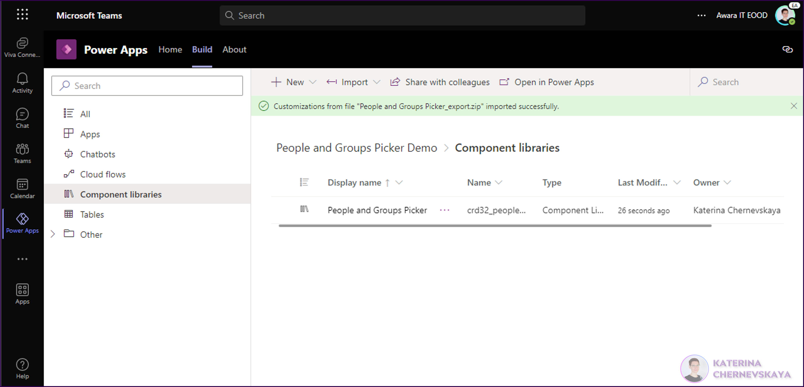

To add the `People and Group Picker` to your apps please following these steps: 
* Go to the `Apps` tab and create a new Canvas app with `Tablet form factor`
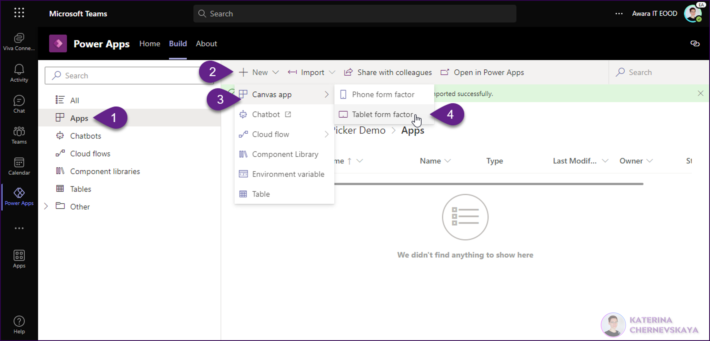
* Go to `Insert` tab and click on `Get more components`. Select the `PeopleAndGroupsPicker` component and click `Import`
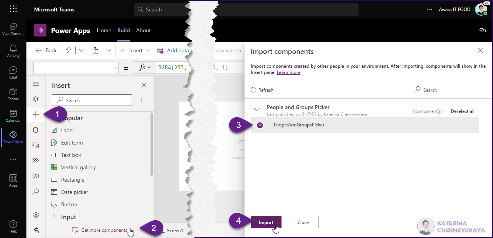
* Click `Allow` on the pop-up window to provide permissions to use Office 365 Users and Office 365 Groups connectors.
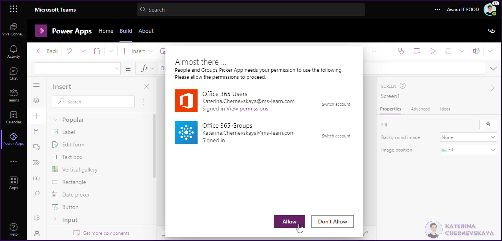
* In the `Insert` tab open the `Library components` and select the `PeopleAndGroupsPicker` component.
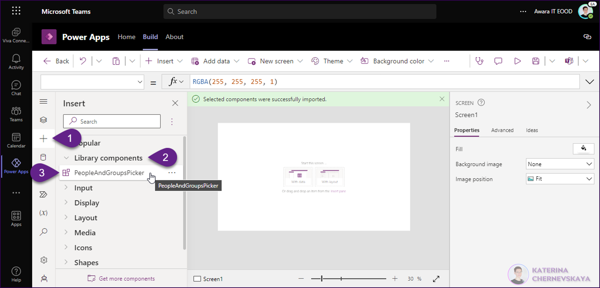

That's it. Now you can work with the `People and Groups Picker` component in your app.

To customize color schema of the component - please use its `Custom properties`:
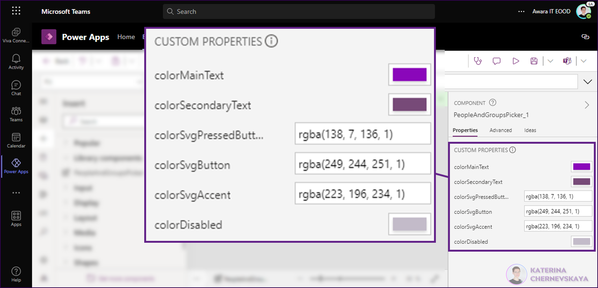

To work with the output property you can use [COMPONENT_NAME_IN_YOUR_APP].colMembers:
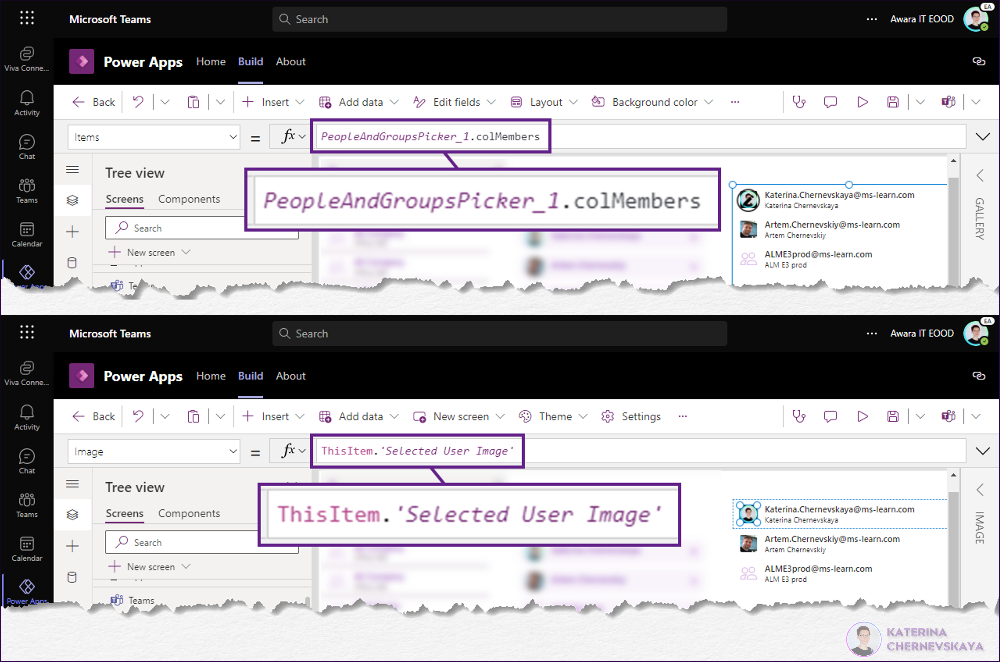

## Disclaimer

**THIS CODE IS PROVIDED *AS IS* WITHOUT WARRANTY OF ANY KIND, EITHER EXPRESS OR IMPLIED, INCLUDING ANY IMPLIED WARRANTIES OF FITNESS FOR A PARTICULAR PURPOSE, MERCHANTABILITY, OR NON-INFRINGEMENT.**

## Help

We do not support samples, but we this community is always willing to help, and we want to improve these samples. We use GitHub to track issues, which makes it easy for  community members to volunteer their time and help resolve issues.

If you encounter any issues while using this sample, you can [create a new issue](https://github.com/pnp/powerapps-samples/issues/new?assignees=&labels=Needs%3A+Triage+%3Amag%3A%2Ctype%3Abug-suspected&template=bug-report.yml&sample=YOURSAMPLENAME&authors=@YOURGITHUBUSERNAME&title=YOURSAMPLENAME%20-%20).

For questions regarding this sample, [create a new question](https://github.com/pnp/powerapps-samples/issues/new?assignees=&labels=Needs%3A+Triage+%3Amag%3A%2Ctype%3Abug-suspected&template=question.yml&sample=YOURSAMPLENAME&authors=@YOURGITHUBUSERNAME&title=YOURSAMPLENAME%20-%20).

Finally, if you have an idea for improvement, [make a suggestion](https://github.com/pnp/powerapps-samples/issues/new?assignees=&labels=Needs%3A+Triage+%3Amag%3A%2Ctype%3Abug-suspected&template=suggestion.yml&sample=YOURSAMPLENAME&authors=@YOURGITHUBUSERNAME&title=YOURSAMPLENAME%20-%20).

## For more information

- [Overview of creating apps in Power Apps](https://docs.microsoft.com/powerapps/maker/)
- [Power Apps canvas apps documentation](https://docs.microsoft.com/en-us/powerapps/maker/canvas-apps/)

